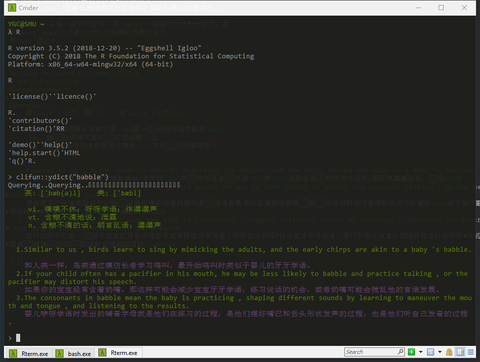

# `clifun`: wrapper functions of funny `UNIX` commands


## Installation


```r
## install.packages("devtools")
devtools::install_github("GuangchuangYu/clifun")
```


## Authors

Guangchuang YU <https://guangchuangyu.github.io>

School of Basic Medical Sciences, Southern Medical University


## System Requirement

+ figlet: <http://www.figlet.org/>
+ lolcat: <https://pypi.python.org/pypi/lolcat> or <https://github.com/tehmaze/lolcat>
+ ydict: <https://github.com/TimothyYe/ydict>

## Usage and examples




